# Pokemon Store

- <a href="#introduction">Introduction</a>
- <a href="#objective">Objective</a>
- <a href="#the-store">The Store</a>
- <a href="#challenge">Challenge</a>
- <a href="#solutions">Solutions</a>
- <a href="#tecnologies">Tecnologies</a>
- <a href="#init-project">Init Project</a>
- <a href="#start-project">Start Project</a>
- <a href="#storybook">Storybook</a>
- <a href="#test">Test</a>
- <a href="#pipeline">Pipeline</a>
- <a href="#memo-license">License</a>

## Introduction

Pokemon Store é um projeto que gera uma loja pokemon do tipo que você quiser.

Para isso é preciso cadastrar as cores do thema, referente ao tipo e hospedar
definindo a variavel de ambiente como o tipo desejado.

O projeto já possui 4 tipos pré definido, Fire, Water, Grass e Dragon.

## Objective

O objetivo do projeto era de criar 3 lojas pokemons com o mesmo comportamento. A
loja possuiria, pagina de catalogo, pagina de produto, o cart e uma busca.

## The Store

- <a href="https://pokemon-store-fire.herokuapp.com/" target='_blank'>Main</a>
- <a href="https://pokemon-store-fire.herokuapp.com/catalog" target='_blank'>Fire</a>
- <a href="https://pokemon-store-water.herokuapp.com/catalog" target='_blank'>Water</a>
- <a href="https://pokemon-store-dragon.herokuapp.com/catalog" target='_blank'>Dragon</a>
- <a href="https://pokemon-store-grass.herokuapp.com/catalog" target='_blank'>Grass</a>

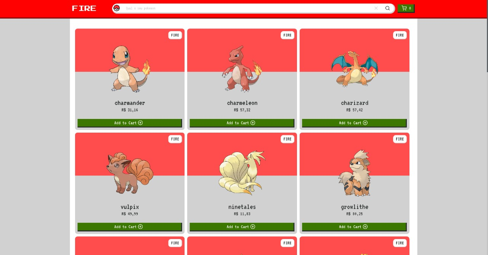
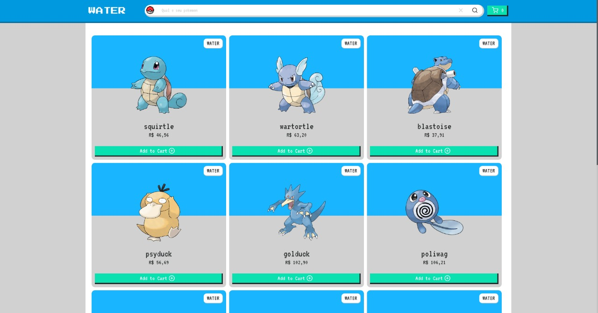
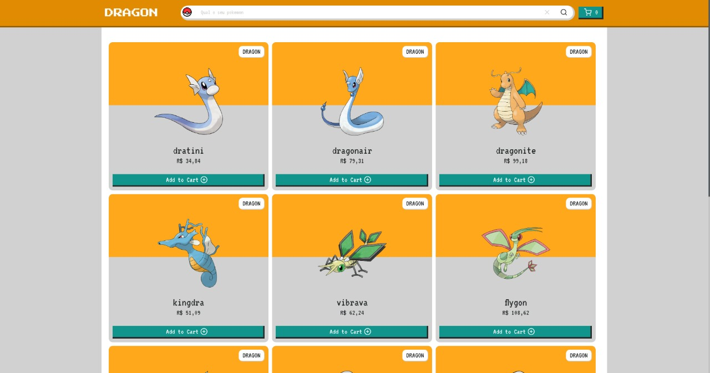
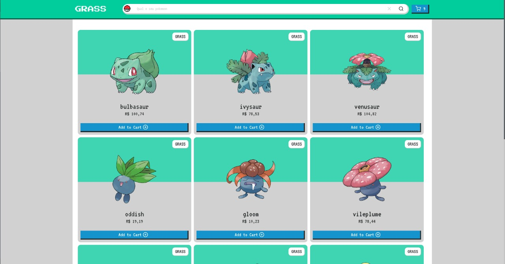

O projeto foi todo criado como mobile-first, com um layout bem descontraído, cada
tema possuim um conjunto de cores primarias, secundarias e tercearias, black, white
gray, error, success, na sua maioria com tons de dark e light. Tambem possuem
cores pré definidas de text, background, para que as cores não se sobreponham,
independente do tema.

Todas as lojas possuem a mesma pagina main, a main não possuim tema, ela é
responsavel apenas por lista todas as lojas e disponibilizar link para a pagina de
catalogo das mesmas.

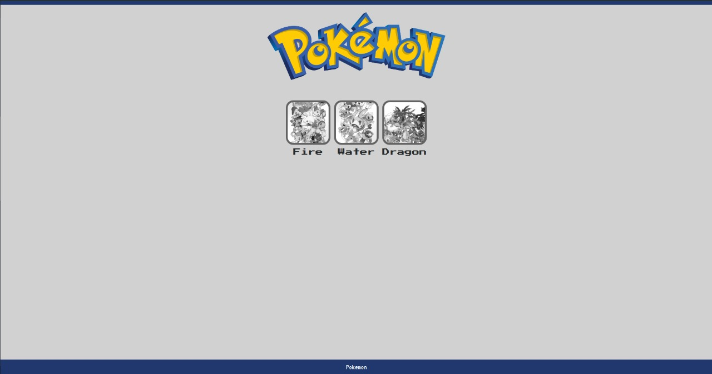

A pagina de catalogo lista todos os pokemon disponivei na api [pokeapi.co](https://pokeapi.co/)
e as imagems dos pokemon vieram da api [pokeres.bastionbot.org](https://pokeres.bastionbot.org/)
onde eu só precisava passar a url com o numero do pokemon .png para conseguir a
imagem dele. Ex.: https://pokeres.bastionbot.org/images/pokemon/25.png.

Nos casos em que a api não possuia a imagem eu inseri no fallback de erro do img a
imagem do pokemon MissingNo. que é um pokemon bugado, uma solução engraçada para
para um problema que existia.

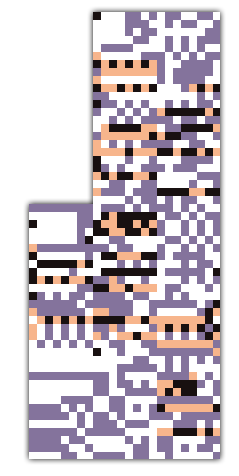

No final da pagina de catalogo ele possui uma paginação bem simples onde ele exibe de 10
em 10 pokemon.

Um ponto a ser comentado é que a requisição a api é feita apenas uma vez, e a lista é
guardada no localstorage, uma nova requisição só é feita caso essa lista seja perdida.

Tanto a persistencia do carrinho quanto o da lista é separada por tema.

O cart pode ser acessado tando da pagina de catalogo quanto da pagina de produto,
o botão fica disponivel no header da pagina. É possivel excluir produtos do cart e
ao finalizar a comprar o comportamento é de fechar o cart, limpar o mesmo e
exibir uma modal de agradecimento com 10% de cashback com base no valor total.

### Cart

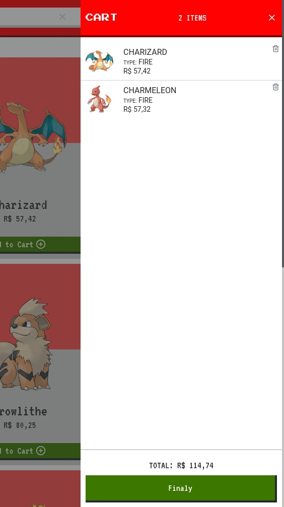

### Modal de finalizar compra

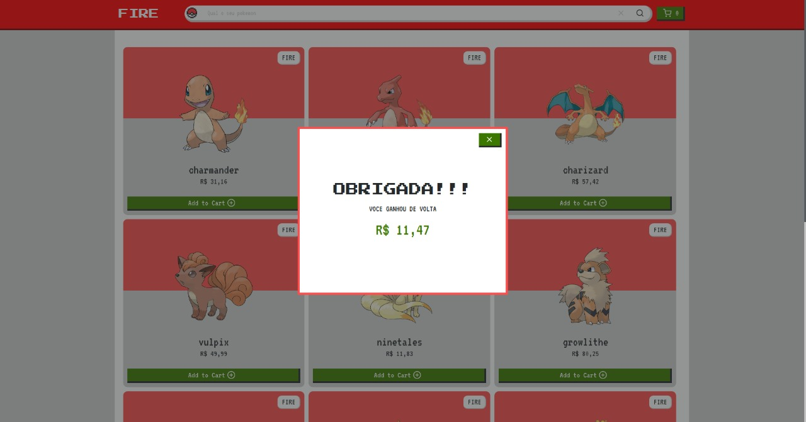

### Cart vazio

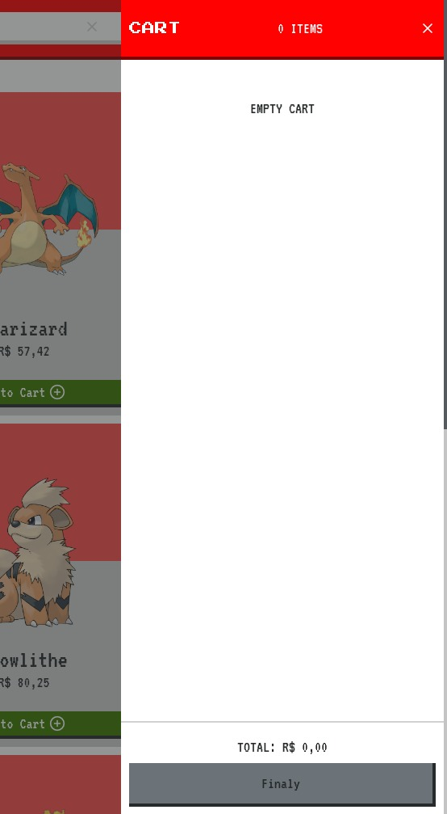

O search é bem simples, ele realiza um filter das lista do catalogo e compara o valor
do input com o nome do pokemon, utilizei uma regex bem simples pra isso, com isso ele
retorna um nova lista que é passada para o componete que exibi o filtro.

Toda vez que você atualiza a lista do cart ele mostra uma notificação com a
foto e o nome do ultimo pokemon que foi adicionado.

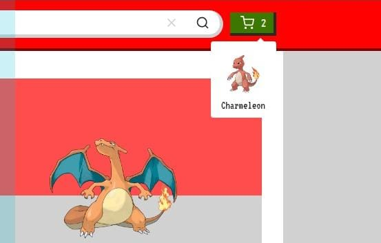

Na pagina de produto, no mobile ele possui o button e o price fixados a base
na pagina, assim é possivel adicionar ao carrinho a qualquer momento, mesmo que
tenha realizado um scroll, o mesmo acontece no desk, porem toda a barra da direita
acompanha o scroll, mantendo sempre em vista o price e o button addToCart.

### Desk

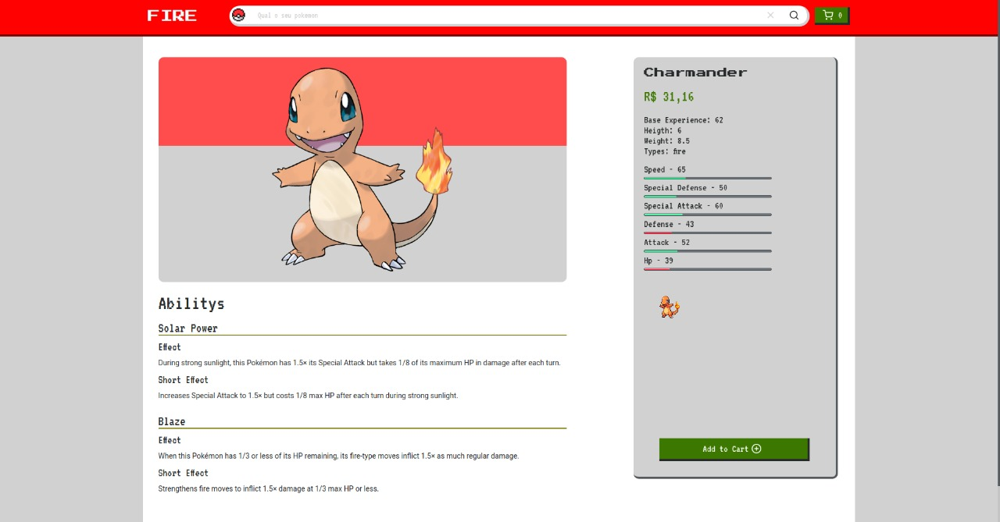
 

### Mobile

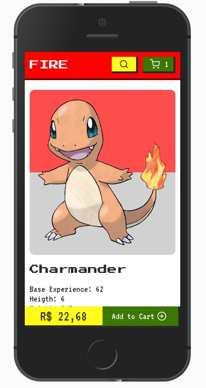

## Challenge

O desafio principal desse projeto foi criar varias pokemon stories com apenas um
codigo de manutenção.

## Solutions

Para manter apenas um codigo para as diversas lojas, o projeto todo se baseou no
tema que era definido por uma variavel de ambiente chamada REACT_APP_TYPE.

O tema era um conjunto de variaveis com suas cores definidas para cada tipo Pokemon.

Como o price era gerado de forma randomica, uma solução que eu dei, para manter
o mesmo valor exibido com o valor que estava no carrinho, foi de persistir tambem
a pagina de catalogo, assim alem dele não precisar fazer requisição na api toda vez
eu saberia que o price é o mesmo, já que seriam duas listas diferentes. Caso
a lista do catalogo fosse atualizada, a persistencia do carrinho é perdida, pois já
não teria como ter os mesmos valores.

## Tecnologies

- ReactJS
- Redux
- Prop Types
- React Router Dom
- React Icons
- Axios
- Styled Components
- Styled Theming
- Uuidv4
- Storybook
- Eslint
- Prettier

## Init Project

Para iniciar o projeto execute o comando `yarn` ou `npm i` na raiz do projeto.

## Start Project

Para rodar o projeto execute o comando `yarn dev` ou `npm run dev` na raiz do projeto.

## Storybook

O Storybook é responsavel pela documentação, exibição e testes dos componentes do projeto.

No processo de desenvolvimento, o storybook é essencial no desenvolvimento de componentes,
ele ajuda no isolamento e na compreenção do escopo. E possivel configurar um playground
para cada componente e ele tambem utiliza das proptypes para documentar as propriedades.

### Componente

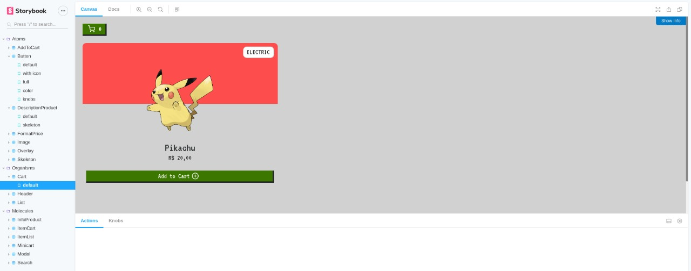
 

### Playground

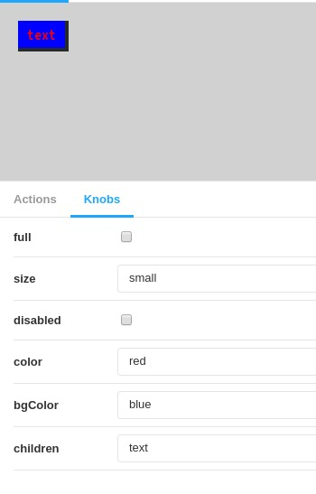
 

### Documentação

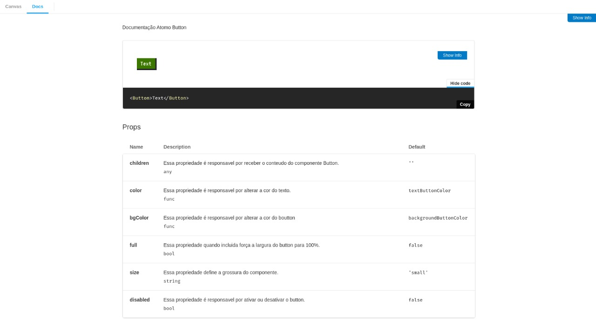
 

## Start

Para rodar os stories execute o comando `yarn storybook` ou `npm run storybook` na raiz do projeto.

Tambem é possivel alterar o tema no storybook, por default ele está rodando com
o tema fire, mas caso queira alterar, acesse o package.json e atlear a linha
"storybook": "REACT_APP_TYPE=fire start-storybook -p 6006", alterando o fire para
qualquer uma das opções já cadastradas, dragon, water e grass.

## Test

Realizei testes de renderização apenas dos atomos. Não tenho muita pratica com
testes porem entendo a importancia deles.

Para rodar os testes execute o comando `yarn test` ou `npm run test` na raiz do projeto.

Está configurado para exibir o coverage.

## Pipeline

Foi criado um pipeline para uma rapida atualização de todos os projetos, já que ele possuim um mesmo codigo base. Basicamente, toda vez que a master é atualiza, o pipeline é executado,
atualizando todos os sites com a ultima versão do projeto.

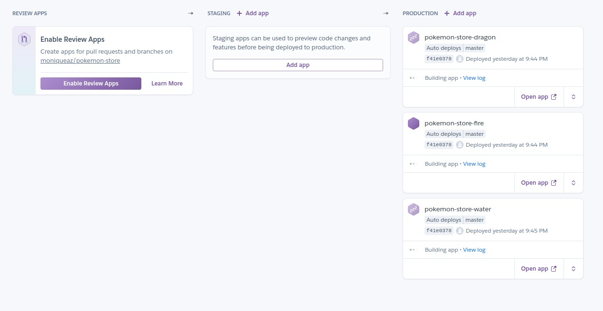
 

### Build sendo executado

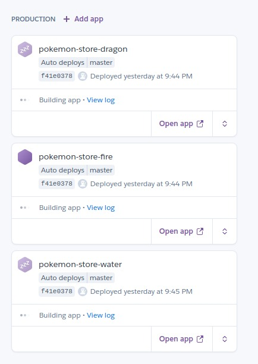

## :memo: License

Esse projeto está sob a licença MIT. Veja o arquivo [LICENSE](LICENSE.md) para mais detalhes.
